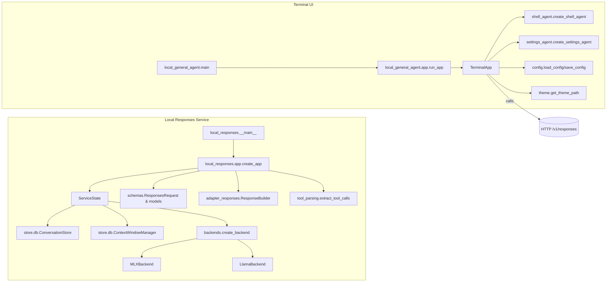

# Python Module Breakdown

This document maps every Python file in the repository, clarifying what each module does, the important constraints it enforces, and where its classes and functions are consumed. Use it as a quick reference when navigating or extending the codebase.

## Runtime Architecture (High-Level)

---

## `local_responses` package

### `local_responses/__init__.py`
- **Purpose:** Exposes the package version via `get_version()`.
- **Key specifics:** Falls back to `"0.1.0"` when package metadata is unavailable; useful in editable installs.
- **Usage:** Imported implicitly when the package is referenced. `get_version()` is currently unused inside the repo but provides a stable API for external callers.

### `local_responses/config.py`
- **Purpose:** Dataclass configuration layer for service, database, and model settings.
- **Key specifics & constraints:**  
  - `BackendName` literal restricts `ModelConfig.backend` to `"mlx_granite"` or `"llama_cpp"`.  
  - Defaults match the Granite tiny model, a 16k-token window, and WAL-enabled SQLite.
- **Usage:**  
  - `ServiceConfig` consumed by `local_responses.app.create_app` to bootstrap state.  
  - `local_responses.__main__.serve` builds a `ServiceConfig` from CLI flags.

### `local_responses/backends/__init__.py`
- **Purpose:** Declares the backend protocol (`Backend`) and shared data containers used by concrete model integrations.
- **Key specifics:**  
  - `GenerationParams` centralises model settings (temperature, top_p, stop sequences, penalties, response format).  
  - `StreamChunk` and `GenerationResult` standardise streaming vs. non-streaming outputs.
- **Usage:**  
  - `local_responses.app` builds `GenerationParams` and expects a `Backend`.  
  - `MLXBackend` and `LlamaCppBackend` implement the protocol.  
  - `create_backend()` loads the correct backend based on `ServiceConfig.model.backend`.

### `local_responses/backends/mlx_backend.py`
- **Purpose:** Concrete backend that streams completions using the `mlx-lm` library.
- **Key specifics & constraints:**  
  - Asynchronously loads one of `_DEFAULT_REPOS` (Granite 4.0 tiny variants) and memoises model/tokenizer instances behind an `asyncio.Lock`.  
  - Streaming runs on a worker thread, pushing `StreamChunk` items via an `asyncio.Queue`.  
  - Does **not** support JSON schema responses (`supports_json_schema` returns `False`).
- **Usage:** Instantiated through `create_backend()` when the configured backend name normalises to `mlx`/`granite`. Its `tokenizer` property is used by `ServiceState` to count prompt tokens and trim history.

### `local_responses/backends/llamacpp_backend.py`
- **Purpose:** Placeholder backend defining the llama.cpp integration surface.
- **Key specifics:** Every public method raises `NotImplementedError`; `supports_json_schema()` returns `True` to signal intended capabilities.
- **Usage:** `create_backend()` returns this class when `ServiceConfig.model.backend` is `"llama_cpp"`. `ServiceState.ensure_backend_ready()` converts the `NotImplementedError` into a `503` HTTP error.

### `local_responses/store/db.py`
- **Purpose:** SQLite persistence for conversations, messages, and responses, plus history trimming logic.
- **Key specifics & constraints:**  
  - Creates `conversations`, `responses`, and `messages` tables on first run; WAL journaling and `synchronous=NORMAL` are enforced.  
  - `append_messages()` batches inserts per turn and returns the last turn index.  
  - `record_response()` stores both input and output payloads as JSON.  
  - `ContextWindowManager.trim()` relies on the backend tokenizer to enforce the configured token budget, falling back to a sliding window drop of oldest messages.
- **Usage:**  
  - `ServiceState` owns a `ConversationStore` instance.  
  - `prepare_prompt()` seeds and fetches history; `record_response()` persists completed responses.  
  - Tests do not touch storage directly.

### `local_responses/store/__init__.py`
- **Purpose:** Convenience re-export of `ConversationStore` and `ContextWindowManager`.
- **Usage:** `local_responses.app` imports both symbols from this module.

### `local_responses/tool_parsing.py`
- **Purpose:** Extracts `<tool_call>...</tool_call>` spans from model output and converts them into structured tool call objects.
- **Key specifics & constraints:**  
  - Raises `ToolCallParseError` when JSON is invalid, missing fields, or provides non-dict arguments.  
  - `extract_tool_calls()` returns `(clean_text, tool_calls)` where `clean_text` is the original output without tool call tags.  
  - Each tool call gets a deterministic `call_id` based on the `prefix` argument and discovery order.
- **Usage:**  
  - `local_responses.adapter_responses.ResponseBuilder` stores parsed tool calls.  
  - `local_responses.app` strips tool call markup during both streaming and non-streaming flows and maps parsing failures to HTTP 422 errors.

### `local_responses/adapter_responses.py`
- **Purpose:** Builds OpenAI-compatible Responses payloads and server-sent event frames.
- **Key specifics & constraints:**  
  - `ResponseBuilder` accumulates text (visible vs. raw), tool calls, and token accounting while the backend streams.  
  - SSE helpers (`response_created_event`, `response_output_delta_event`, etc.) produce fully encoded `event:` blocks ready for streaming.  
  - `new_id()` prefixes unique IDs (`resp_`, `msg_`, `call_`) using a cryptographically secure token.
- **Usage:**  
  - Only `local_responses.app` instantiates `ResponseBuilder` and publishes the SSE events during streaming.  
  - `ResponsePayload` produced by `ResponseBuilder.build_payload()` is persisted by `ConversationStore.record_response()`.

### `local_responses/schemas.py`
- **Purpose:** Pydantic models aligning with the OpenAI `/v1/responses` contract.
- **Key specifics & constraints:**  
  - `ResponsesRequest.normalized_messages()` accepts either `messages` or `input` shapes and canonicalises them to `{role, content}` chat messages; it rejects empty inputs with a `ValueError`.  
  - `ToolDefinition.as_openai_tool()` supports the legacy `"function"` shorthand and enforces presence of a function name.  
  - `ResponsePayload` and related models (`ResponseOutputMessage`, `ResponseFunctionCall`, `ResponseUsage`) mirror OpenAI semantics.
- **Usage:**  
  - FastAPI automatically validates request bodies with `ResponsesRequest`.  
  - `local_responses.app` leans on `normalized_messages()` and the tool conversion helpers.  
  - `test_responses_normalization.py` ensures resilience of message normalisation and tool handling.

### `local_responses/app.py`
- **Purpose:** FastAPI application factory and end-to-end request handler for the Local Responses service.
- **Key specifics & constraints:**  
  - `ServiceState` holds config, storage, backend, tokenizer-aware context management, and default system prompt (loaded from `prompts/system.txt` when present).  
  - `create_app()` wires health checks, model listing, and `/v1/responses` with both streaming (SSE) and non-streaming paths.  
  - Enforces API-key auth (via `Authorization: Bearer` or `local-api-key`) when configured.  
  - Streaming handler incrementally strips tool calls, emits deltas, persists assistant turns, and records responses.  
  - Non-streaming handler follows the same parsing path but returns a `JSONResponse`.
- **Usage:**  
  - `local_responses.__main__.serve` launches the app with Uvicorn.  
  - Any external ASGI host can import `create_app()` directly.  
  - Tests depend on schema logic but not the FastAPI app itself.

### `local_responses/__main__.py`
- **Purpose:** Typer CLI entry point that configures and starts the FastAPI server using Uvicorn.
- **Key specifics & constraints:**  
  - CLI flags map directly onto `ServiceConfig` fields (host, port, backend, model ID, sampling params, DB path, API key).  
  - `--reload` and `--log-level` are passed through to Uvicorn for development use.
- **Usage:** Invoked via `python -m local_responses` or `local_responses.__main__.main()`. The CLI delegates to `create_app()` to construct the FastAPI instance.

---

## `local_general_agent` package

### `local_general_agent/__init__.py`
- **Purpose:** Public package API exposing the terminal app, configuration helpers, and available themes.
- **Usage:** Imported by tests (`test_theme.py`) to access `TerminalApp`, `load_config`, and related utilities.

### `local_general_agent/config.py`
- **Purpose:** Manages persistent application configuration stored in `config/settings.json`.
- **Key specifics & constraints:**  
  - Defaults enforce the `"dark"` theme and 16 384-token context window.  
  - `load_config()` validates the persisted theme against the available set, sanitises the context window, and rewrites the file to keep defaults in sync.  
  - Raw settings helpers (`load_settings_dict()`, `config_path()`) support tooling agents.
- **Usage:**  
  - `TerminalApp` loads and saves user preferences.  
  - `create_settings_agent()` reads the on-disk settings via the injected loader.  
  - `test_theme.py` exercises round-trip persistence and theme application.

### `local_general_agent/theme.py`
- **Purpose:** Resolves Textual theme assets for the terminal UI.
- **Key specifics:**  
  - `THEMES` maps logical names to `.tcss` files; missing files raise `FileNotFoundError`.  
  - `available_themes()` returns sorted keys, and `DEFAULT_THEME` ties back to configuration defaults.
- **Usage:**  
  - `TerminalApp` relies on `available_themes()` during setup and menu construction.  
  - Tests iterate through the available themes when asserting `TerminalApp.apply_theme()`.

### `local_general_agent/shell_agent.py`
- **Purpose:** Builds a restricted tooling agent that exposes safe filesystem and text operations.
- **Key specifics & constraints:**  
  - Enforces workspace confinement, size caps (`MAX_WRITE_CHARS`, `MAX_READ_BYTES`, etc.), and a whitelist of commands for `run_safe_command`.  
  - Falls back to a pure-Python regex search when `rg` is unavailable.  
  - Provides tools: directory listing, PWD, read/write/append file, regex search, and limited shell execution.
- **Usage:**  
  - `TerminalApp` instantiates the agent via `create_shell_agent()` and registers its tools with the main assistant.  
  - No other modules import it directly.

### `local_general_agent/settings_agent.py`
- **Purpose:** Supplies an agent that reads and mutates application settings through function tools.
- **Key specifics & constraints:**  
  - Validates and coerces value types based on existing settings (e.g., booleans, integers).  
  - `list_settings` returns a formatted snapshot; `update_setting` ensures one-key-at-a-time updates and summarises the new configuration.
- **Usage:**  
  - `TerminalApp` wires the returned agent as both a handoff target and a tool (`manage_settings`).  
  - Depends on injected callbacks (`load_settings`, `apply_setting`) defined inside `TerminalApp`.

### `local_general_agent/app.py`
- **Purpose:** Implements the Textual-based terminal UI that fronts the local responses service.
- **Key specifics & constraints:**  
  - Sets up the main `TerminalApp` class with menu navigation, message streaming, slash commands, settings management, and logging utilities.  
  - Uses the external `agents` SDK to manage tool-calling assistants, handoff flows, and streaming via `AsyncOpenAI`.  
  - Manages lifecycle of the local responses FastAPI server (start/stop/restart subprocess) and keeps a session database (`SQLiteSession`).  
  - Provides helper dataclasses (`MenuItem`, `MenuNode`, `StreamingState`) and numerous private methods for UI behaviour, streaming management, and settings enforcement.  
  - Exposes `run_app()` convenience wrapper used by the CLI.
- **Usage:**  
  - `local_general_agent.main` and package `__init__` call `run_app()` / expose `TerminalApp`.  
  - `test_theme.py` instantiates `TerminalApp` to verify theming logic.

### `local_general_agent/main.py`
- **Purpose:** Simple CLI entry point that runs the terminal application.
- **Usage:** Executed via `python -m local_general_agent` or similar wrappers; forwards to `run_app()`.

---

## Test Modules

### `test_responses_normalization.py`
- **Purpose:** Verifies `ResponsesRequest.normalized_messages()` and `ToolDefinition.as_openai_tool()`.
- **Key specifics:** Ensures mixed input payloads (function calls, tool outputs, assistant messages) are transformed correctly and that invalid items raise `ValueError`.
- **Coverage links:** Targets `local_responses/schemas.py` exclusively; does not spin up the FastAPI app.

### `test_theme.py`
- **Purpose:** Sanity-checks configuration persistence and theme application in the terminal app.
- **Key specifics:**  
  - Exercises `load_config()`/`save_config()` round-trips.  
  - Confirms `TerminalApp.apply_theme()` updates UI state for every theme advertised by `available_themes()`.
- **Coverage links:** Touches `local_general_agent/config.py`, `local_general_agent/theme.py`, and `local_general_agent/app.py`.

---

## Cross-Module Notes
- The terminal UI (`local_general_agent`) communicates with the FastAPI service over HTTP; there is no direct Python import dependency between the two packages.
- Persistent state is split: `local_responses` stores conversations in SQLite, while `local_general_agent` keeps user preferences in a JSON file and assistant sessions in SQLite (`agents.SQLiteSession`).
- The placeholder llama.cpp backend can be enabled via CLI, but requests will fail until the implementation lands; `ServiceState.ensure_backend_ready()` translates that into a 503 error.
- API key checks are optional and controlled entirely by `ServiceConfig.api_key`; terminal clients honour this via environment variables (`LOCAL_RESPONSES_API_KEY`).
