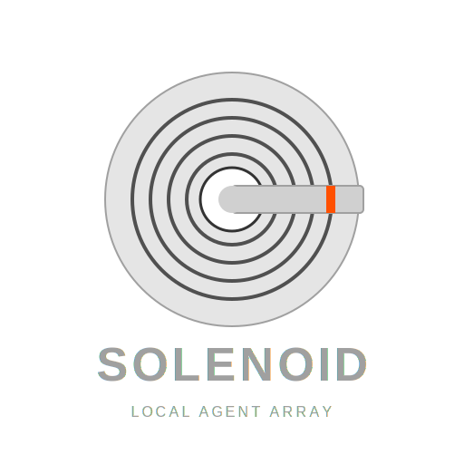

<p align="center">
  
</p>

# Solenoid
A multi-agent system powered by Google ADK with an AG-UI compatible API server and Textual-based terminal client.

## Features

- **Multi-Agent Architecture**: Hierarchical agent system with specialized agents for different tasks
- **AG-UI Protocol**: Standards-compliant streaming API with Server-Sent Events (SSE)
- **Textual TUI Client**: Modern terminal-based chat interface with real-time streaming
- **Local Code Execution**: Secure WASM sandbox for Python execution with Pygal charting
- **Web Research**: Brave Search integration for real-time web queries
- **MCP Support**: Model Context Protocol for extensible tool integration (stdio and HTTP servers)
- **Local Memory System**: SQLite + FTS5 + sqlite-vec for hybrid semantic/keyword search with BGE reranking
- **Configurable Models**: Support for Ollama models via LiteLLM with automatic model pulling
- **Customizable Prompts**: All agent prompts configurable via YAML

## Installation

This project uses `poetry` for dependency management:

```bash
# Install dependencies (creates the virtual environment)
poetry install
```

## Quick Start

### Bundled Mode (Recommended)

Start both backend and frontend with a single command:

```bash
poetry run local-agent
```

This launches the FastAPI backend silently in the background and opens the Textual TUI in your terminal.

### Separate Processes

For development or debugging, run the server and client separately:

```bash
# Terminal 1: Start the AG-UI API server
poetry run uvicorn app.server.main:app --port 8000

# Terminal 2: Start the terminal client
poetry run terminal-app
```

The client connects to `http://localhost:8000/api/agent` by default.

## Architecture

### System Overview

```
+------------------------------------------------------------------+
|                         TUI Client                               |
|                   (app/ui/agent_app.py)                          |
|              Textual-based terminal interface                    |
+-----------------------------+------------------------------------+
                              | AG-UI SSE Stream
                              v
+------------------------------------------------------------------+
|                       FastAPI Server                             |
|                   (app/server/main.py)                           |
|            AG-UI Protocol endpoint: /api/agent                   |
+-----------------------------+------------------------------------+
                              |
                              v
+------------------------------------------------------------------+
|                      Agent Hierarchy                             |
|                                                                  |
|   user_proxy_agent (gateway)                                     |
|   +-- prime_agent (router)                                       |
|       +-- planning_agent (coordinator)                           |
|           +-- code_executor_agent    (WASM Python sandbox)       |
|           +-- chart_generator_agent  (Pygal visualizations)      |
|           +-- research_agent         (Web search + retrieval)    |
|           +-- mcp_agent              (MCP tools integration)     |
|           +-- generic_executor_agent (General knowledge tasks)   |
+------------------------------------------------------------------+
```

### Project Structure

```
main_bundled.py                   # Bundled entry point (backend + frontend)
app/
├── __init__.py
├── main.py                       # TUI-only entry point
├── server/
│   └── main.py                   # FastAPI AG-UI server
├── ui/
│   ├── agent_app.py              # Textual TUI application
│   ├── agui/                     # AG-UI protocol client
│   │   ├── client.py             # SSE stream client
│   │   └── types.py              # Event type definitions
│   ├── chat_input/               # Input widget
│   └── message_list/             # Message display widget
├── agent/
│   ├── config.py                 # Settings loader
│   ├── prime_agent/
│   │   ├── agent.py              # Prime agent (router)
│   │   └── user_proxy.py         # User proxy agent (gateway)
│   ├── planning_agent/
│   │   ├── agent.py              # Planning coordinator
│   │   └── generic_executor.py
│   ├── code_executor_agent/      # WASM Python executor
│   ├── chart_generator_agent/    # Pygal chart generation
│   ├── research_agent/           # Web search agent
│   ├── mcp_agent/                # MCP tools agent
│   ├── memory/
│   │   ├── adk_sqlite_memory.py  # ADK memory service
│   │   ├── embeddings.py         # Nomic embeddings
│   │   ├── search.py             # Hybrid search
│   │   └── rerank.py             # BGE reranking
│   ├── search/
│   │   ├── universal_search.py   # Brave Search
│   │   └── web_retrieval.py      # Page content fetching
│   ├── local_execution/
│   │   ├── wasm_engine.py        # Wasmtime runtime
│   │   └── adk_wrapper.py        # ADK code executor
│   ├── models/
│   │   └── factory.py            # LiteLLM model factory
│   └── ollama/
│       └── ollama_app.py         # Ollama server management
└── resources/
    └── python-wasi/              # Python WASM runtime
```

### Agent Roles

| Agent | Role | Capabilities |
|-------|------|--------------|
| `user_proxy_agent` | Gateway | Receives user requests, delegates to prime_agent, validates responses |
| `prime_agent` | Router | Decides whether to answer directly or delegate to planning_agent |
| `planning_agent` | Coordinator | Creates execution plans, delegates to specialist agents |
| `code_executor_agent` | Code execution | Runs Python in WASM sandbox, math calculations |
| `chart_generator_agent` | Visualization | Creates Pygal charts (bar, line, pie, scatter, etc.) |
| `research_agent` | Web research | Searches the web, retrieves page content |
| `mcp_agent` | Tool integration | Uses MCP servers for documentation lookup, file operations |
| `generic_executor_agent` | General tasks | Writing, summaries, explanations, general knowledge |

## Configuration

All configuration is managed through `app_settings.yaml` in the project root.

### Model Configuration

```yaml
models:
  default:
    name: "ministral-3:8b"
    provider: "ollama_chat"
    context_length: 128000
  agent:
    name: "ministral-3:8b"
    context_length: 128000
  extractor:
    name: "ministral-3:8b"
```

**Model Roles:**
- `default`: Fallback model for unspecified roles
- `agent`: Used by all agent roles (requires function calling support)
- `extractor`: Used for memory extraction

**Model Requirements:**
- Models used for the `agent` role must support **function calling** (tool use)
- Recommended: `ministral-3:8b`, `qwen3:8b`, `llama3.1`, or similar function-calling capable models
- Uses Ollama model names from the [Ollama library](https://ollama.com/library)

**Automatic Model Pulling:**
If a configured model is not found in your local Ollama instance, the application automatically attempts to pull it when the agent starts.

### Search Configuration

```yaml
search:
  provider: "brave"
  brave_search_api_key: "YOUR_BRAVE_API_KEY"
```

The `research_agent` uses Brave Search for web queries. Get an API key from [Brave Search API](https://brave.com/search/api/).

### MCP Server Configuration

MCP servers are configured in `app_settings.yaml`:

```yaml
mcp_servers:
  # stdio-based server (local process)
  filesystem:
    command: "npx"
    args:
      - "-y"
      - "@modelcontextprotocol/server-filesystem"
      - "./"

  # HTTP-based server (remote)
  context7:
    type: "http"
    url: "https://mcp.context7.com/mcp"
    headers:
      CONTEXT7_API_KEY: "your-api-key"
```

**Supported Server Types:**
- `stdio`: Launches a local process (default, requires `command` and `args`)
- `http`: Connects to a remote HTTP server (requires `url`, optional `headers`)

When the agent starts, it initializes the configured MCP servers and adds their tools to the `mcp_agent`'s toolset. This allows the agent to use these tools seamlessly during conversations.

For example, with the filesystem server configured above, the agent can use tools like `list_directory` and `read_file` to interact with your local files.

### Agent Prompts

All agent instructions are configurable in `app_settings.yaml`:

```yaml
agent_prompts:
  user_proxy_agent: |
    You are the User Proxy, the gateway between the user and the agent system...

  prime_agent: |
    You are the Prime Agent, the intelligent router...

  planning_agent: |
    You are the Chief Planner...

  code_executor_agent: |
    You are a Python Code Executor Agent operating in a secure WASM sandbox...

  chart_generator_agent: |
    You are a Python Chart Generator Agent specializing in Pygal visualizations...

  research_agent: |
    You are the Research Specialist...

  mcp_agent: |
    You are an MCP tools specialist...

  generic_executor_agent: |
    You are the Generic Executor Agent...
```

This allows you to customize agent behavior without modifying code.

## Usage

### TUI Keyboard Shortcuts

| Key | Action |
|-----|--------|
| `Enter` | Send message |
| `Ctrl+C` | Quit application |
| `Ctrl+L` | Clear message feed |

### API Endpoints

| Endpoint | Method | Description |
|----------|--------|-------------|
| `/api/agent` | POST | AG-UI agent run endpoint (SSE stream) |
| `/` | GET | API information and agent hierarchy |
| `/health` | GET | Health check |
| `/docs` | GET | OpenAPI documentation |

### Example API Request

```bash
curl -X POST http://localhost:8000/api/agent \
  -H "Content-Type: application/json" \
  -d '{"messages": [{"role": "user", "content": "What is 15 factorial?"}]}'
```

### Configuring a Custom TUI Endpoint

```python
from app.ui.agent_app import AgentApp

# Connect to a different backend
app = AgentApp(
    base_url="http://other-host:3000",
    endpoint="/api/agent"
)
app.run()
```

## Local Memory System

The application includes a hybrid memory system for persistent context:

- **Storage**: SQLite database (`memories.db`)
- **Full-Text Search**: FTS5 for keyword matching
- **Vector Search**: sqlite-vec for semantic similarity
- **Embeddings**: Nomic Embed Text v1.5 (local, 256D Matryoshka)
- **Reranking**: BGE Reranker v2 m3 for result quality

Memory is automatically managed per session and persisted across restarts.

## Code Execution Environment

Python code runs in a secure WASM sandbox:

- **Runtime**: Wasmtime with Python 3.13 WASI
- **Available Libraries**: Python standard library + Pygal
- **Output**: Captured via stdout (print statements)
- **Charts**: Rendered to SVG files

**Example capabilities:**
- Mathematical calculations
- Data processing with standard library
- Chart generation (bar, line, pie, scatter, histogram, radar)

## Evaluation

Run agent evaluation tests:

```bash
poetry run python tests/eval/run_eval.py --runs 5
```

This executes test cases from `tests/eval/agent_test_cases.csv` and generates reports in `tests/eval/eval_results/`.

## Development

### Requirements

- Python 3.11+
- Poetry (for dependency management)
- Ollama (for local LLM inference)

### Key Dependencies

- `google-adk` - Google Agent Development Kit
- `ag-ui-adk` - AG-UI protocol adapter for ADK
- `textual` - Terminal UI framework
- `fastapi` + `uvicorn` - API server
- `litellm` - LLM provider abstraction
- `sentence-transformers` - Local embeddings
- `sqlite-vec` - Vector search extension
- `wasmtime` - WASM runtime

### Running Tests

```bash
poetry run pytest
```

## Extending the Application

### Adding Custom Tools

Create a new tool using ADK's FunctionTool:

```python
from google.adk.tools.function_tool import FunctionTool

def my_custom_tool(param: str) -> str:
    """Tool description for the agent."""
    return f"Result: {param}"

custom_tool = FunctionTool(func=my_custom_tool)
```

### Adding a New Agent

1. Create a new directory under `app/agent/`
2. Define the agent in `agent.py`:

```python
from google.adk.agents import Agent
from app.agent.models.factory import get_model
from app.agent.config import get_agent_prompt

agent = Agent(
    name="my_agent",
    model=get_model("agent"),
    instruction=get_agent_prompt("my_agent"),
    tools=[...],
)
```

3. Add the prompt to `app_settings.yaml` under `agent_prompts`
4. Register with the planning_agent's sub_agents list in `app/agent/planning_agent/agent.py`

## Credits

- Built with [Google ADK](https://github.com/google/adk-python)
- AG-UI Protocol from [AG-UI](https://docs.ag-ui.com)
- Terminal UI with [Textual](https://github.com/textualize/textual)
- Vector search with [sqlite-vec](https://github.com/asg017/sqlite-vec)
- Embeddings from [Nomic AI](https://www.nomic.ai/)

## License

This is a demonstration project for building multi-agent systems with local LLM inference.
