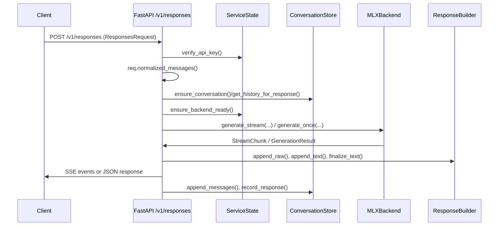

# Local Model Execution Flow

This document explains, in detail, how the `local_responses` service loads a language model, prepares prompts, streams outputs, and persists results. It stitches together the responsibilities of `app.py`, `adapter_responses.py`, `store/db.py`, and `backends/*.py` so you can trace exactly how a `/v1/responses` request turns into locally generated text.

---

## Configuration & Startup

- **Entry points:**  
  - CLI: `python -m local_responses` (`local_responses/__main__.py`)  
  - ASGI import: `local_responses.app.create_app()`
- **ServiceConfig (`local_responses/config.py`):**  
  - `ModelConfig` describes backend (`mlx_granite` or `llama_cpp`), model ID, default sampling parameters, and context window.  
  - `DatabaseConfig` supplies the SQLite path and pragma defaults.  
  - `ServiceConfig` wraps server binding info, optional API key enforcement, and an `enable_llama_backend` flag to expose not-yet-implemented integrations.
- **ServiceState (`local_responses/app.py`):**  
  - Instantiated once per FastAPI app.  
  - Holds the configured `ConversationStore`, `ContextWindowManager`, backend instance (via `create_backend`), and the default system prompt from `prompts/system.txt` if present.  
  - Provides `ensure_backend_ready()` and `verify_api_key()` helpers used by request handlers.

---

## Request Lifecycle Overview

---

## Detailed Execution Steps

### 1. Authentication & Request Normalisation
1. Incoming request is automatically parsed into a `ResponsesRequest` Pydantic model (`schemas.py`). Invalid payloads return a FastAPI-generated 422.
2. `ServiceState.verify_api_key()` blocks unauthorised clients if an API key was configured. It accepts either `Authorization: Bearer <key>` or a `local-api-key` header.
3. `req.normalized_messages()` merges OpenAI-compatible `messages` or `input` shapes into canonical chat messages (tool outputs become `role="tool"` entries, etc.). Empty or malformed inputs raise `ValueError`, returning HTTP 400.

### 2. Conversation State Resolution
1. If `previous_response_id` is provided, the store (`store/db.py`) is queried to ensure the response exists and to align `conversation_id`.
2. `ConversationStore.ensure_conversation()` guarantees a persisted conversation row. New IDs are formatted `conv_<uuid>`.
3. Conversation history is retrieved via either `get_history_for_response()` (when resuming) or `get_messages()`; if history is empty and a default system prompt is available, `prepare_prompt()` seeds it as the first message.

### 3. Prompt Assembly & Context Window Management
1. `prepare_prompt()` merges:
   - Stored history (possibly trimmed).
   - Optional request-scoped `instructions` (added as a synthetic `system` message).
   - Normalised user messages for this turn.
2. All incoming messages are appended to the SQLite `messages` table to maintain turn ordering. The function returns both the prompt messages and the turn index of the last user message.
3. If the backend exposes a tokenizer (MLX does), `ContextWindowManager.trim()` invokes `tokenizer.apply_chat_template(..., tokenize=True)` to count tokens and drops earliest messages until the count fits within `ServiceConfig.model.context_window_tokens`. This implements a sliding window strategy that preserves the most recent conversation exchanges.

### 4. Generation Parameter Construction
- `build_generation_params()` produces a `GenerationParams` dataclass instance merging request overrides with default config values. This includes `temperature`, `top_p`, `max_output_tokens`, stop sequences, and penalty terms. The eventual backend receives these options unchanged.

### 5. Backend Readiness & Model Loading
- `ServiceState.ensure_backend_ready()` calls the backend’s `ensure_ready()` method:
  - **MLXBackend (`backends/mlx_backend.py`):**  
    - Lazily loads model weights and tokenizer from the first successful repo in `_DEFAULT_REPOS` (Granite 4.0 tiny variants) using `mlx_lm.load`.  
    - Uses an `asyncio.Lock` to prevent concurrent loads during startup.  
    - Logs both the attempt and success/failure via the `local_responses.backends.mlx` logger.  
    - Stores the tokenizer reference so prompt token counts can be computed.  
    - Raises `RuntimeError` if all repos fail; the exception propagates as a 503 response.
  - **LlamaCppBackend:** raises `NotImplementedError`, which is caught by `ensure_backend_ready()` and translated into a 503 "Backend not available" response.

### 6. Streaming Response Handling
When `req.stream` is `True`, `create_response()` responds with `StreamingResponse(stream_events(), media_type="text/event-stream")`:

1. **ResponseBuilder Setup:**  
   - Instantiated with the configured model ID, conversation metadata, response format (converted via `_response_format_to_dict()`), instructions, and request metadata.  
   - `set_prompt_tokens()` records the prompt length for usage accounting.
2. **Initial Events:** A pair of SSE frames (`response.created`, `response.in_progress`) is emitted to signal the start of processing.
3. **Backend Streaming:**  
   - `backend.generate_stream()` is awaited inside `stream_events()`.  
   - **MLXBackend implementation:**  
     - Builds a full chat prompt using `tokenizer.apply_chat_template` (including tools if provided).  
     - Configures sampling kwargs (temperature, top-p, stop sequences, `max_tokens`, optional sampler from `mlx_lm.sample_utils`).  
     - Spawns a background thread (`threading.Thread`) that iterates `mlx_lm.stream_generate(...)` and pushes `StreamChunk` objects (carrying both `delta` text and raw SDK objects) into an `asyncio.Queue`.  
     - As the async generator consumes the queue, it yields each chunk back to the FastAPI coroutine. Exceptions raised inside the thread are forwarded by placing them into the queue. The queue terminates with a sentinel `None`.
4. **Tool Call Buffering:**  
   - Every raw chunk is appended via `ResponseBuilder.append_raw()`.  
   - Interim visible text is derived by finding unclosed `<tool_call>` spans (`_find_unclosed_tool_call()`), stripping complete tool call blocks with `extract_tool_calls()`, and comparing against the previously sent text.  
   - New text deltas trigger `response_output_text.delta` SSE frames, emitted with monotonic `sequence_number`s.
5. **Completion:**  
   - Once the backend finishes, the aggregated raw text runs through `extract_tool_calls()` one final time to produce clean assistant text and structured tool calls.  
   - ResponseBuilder finalises state (`finalize_text()`), the assistant message is persisted via `ConversationStore.append_messages()`, and `response.output_text.done` plus `response.completed` events are streamed.  
   - Usage statistics (prompt/completion/total tokens) are included in the final payload.  
   - The conversation turn is recorded in the `responses` table with both input and output payloads stored as JSON blobs.
6. **Error Handling:**  
   - `ToolCallParseError` yields a `response.error` SSE event and surfaces to the client as HTTP 422.  
   - Other exceptions are logged through `ServiceState.logger` and also yield a `response.error` event before propagating.

### 7. Non-Streaming Response Handling
If `req.stream` is `False`, the same preparation logic runs, but the backend is invoked via `generate_once()`:

1. **MLXBackend.generate_once():** Internally iterates `generate_stream()` and concatenates text chunks. The last raw chunk’s `finish_reason` (if present) is returned.
2. The resulting text is fed through the same tool-call extraction path (`finalize_text()`, optional `append_text()`), persisted, and wrapped in a `ResponsePayload`, which FastAPI returns as a `JSONResponse`.

---

## Data Persistence & Token Accounting

- **Messages Table:** Stores every utterance with role, content (JSON string), turn index, and timestamp. Assistants’ raw output (including tool call markup) is what gets saved; this preserves the full model transcript for debugging.
- **Responses Table:** Associates each response with its parent conversation/response, the model ID, instructions, serialized request (`input_json`), serialized response (`output_json`), and `last_message_turn`, enabling history reconstruction.
- **Conversation Store API:**  
  - `get_history_for_response()` fetches all messages up to the turn index recorded on the parent response, ensuring reproducible continuation.  
  - Requests referencing unknown `previous_response_id`s receive HTTP 404.
- **Usage Metrics:**  
  - Prompt tokens are the measured length of `prompt_messages`.  
  - Completion tokens are incremented per appended delta (currently a heuristic counter in lieu of official tokenizer stats).  
  - `ResponsePayload.usage` mirrors OpenAI’s schema, including nested details for cached/reasoning tokens (currently stubbed at zero).

---

## Tool Call Handling

- The service expects models to emit `<tool_call>{...}</tool_call>` spans in their raw output.  
- `tool_parsing.extract_tool_calls()` enforces structured JSON payloads with `name` and `arguments` (auto-parsed if provided as a string).  
- Tool call metadata is surfaced in both SSE events (as `function_call` items) and the final `ResponsePayload`.  
- Any malformed tool call block terminates the request with a 422; SSE clients receive a `response.error` event containing the parse failure description.

---

## Error & Edge Case Behaviour

- **Backend Load Failures:** Logged exceptions with repo IDs; client sees HTTP 503.  
- **Tokenizer Absence:** If the backend lacks a `tokenizer` attribute, prompt token counting and trimming gracefully fall back to unbounded prompts.  
- **Conversation Mismatch:** Providing a `conversation_id` that conflicts with `previous_response_id` yields HTTP 400.  
- **stream_generate Errors:** Any exception from the MLX streaming thread is re-raised inside the async generator, triggering the SSE error path and FastAPI’s exception handling.

---

## Implementing Additional Backends

To add another model runtime:
1. Implement the `Backend` protocol (`backends/__init__.py`) with async `generate_stream` and `generate_once` methods.  
2. Ensure `ensure_ready()` is idempotent and resistant to concurrent calls.  
3. Populate the tokenizer attribute or adjust trimming logic accordingly.  
4. Update `create_backend()` to recognise the new backend name and forward constructor kwargs (e.g., repo IDs, credentials).

The rest of the request pipeline remains unchanged—only the backend module needs to supply compatible streaming/generation behaviour.

---

## Useful Reference Points

- Request handler: `local_responses/app.py:create_response()`  
- Prompt preparation: `local_responses/app.py:prepare_prompt()`  
- Streaming events: `local_responses/app.py:stream_events()` inner coroutine  
- Response builder: `local_responses/adapter_responses.py:ResponseBuilder`  
- Tool call parsing: `local_responses/tool_parsing.py:extract_tool_calls()`  
- Conversation persistence: `local_responses/store/db.py:ConversationStore`  
- MLX backend: `local_responses/backends/mlx_backend.py` (model loading + streaming)
